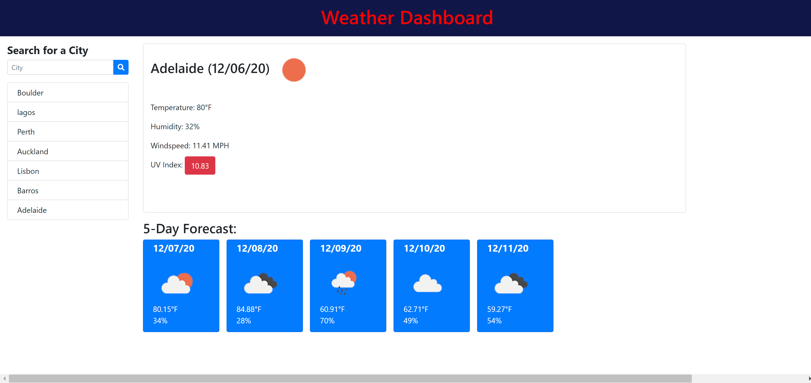

# Weather App

### Objective

Create a functional weather dashboard for a user to input a city into a search and using the Openweather API to retrieve weather data and weather forecast.

Utilizes: HTML, CSS, JavaScript, jQuery, Open Weather Map API, Bootstrap, Font-Awesome

[Link to HW 6](https://samfan808.github.io/Cool-Weather-App/)

Screenshot below:

